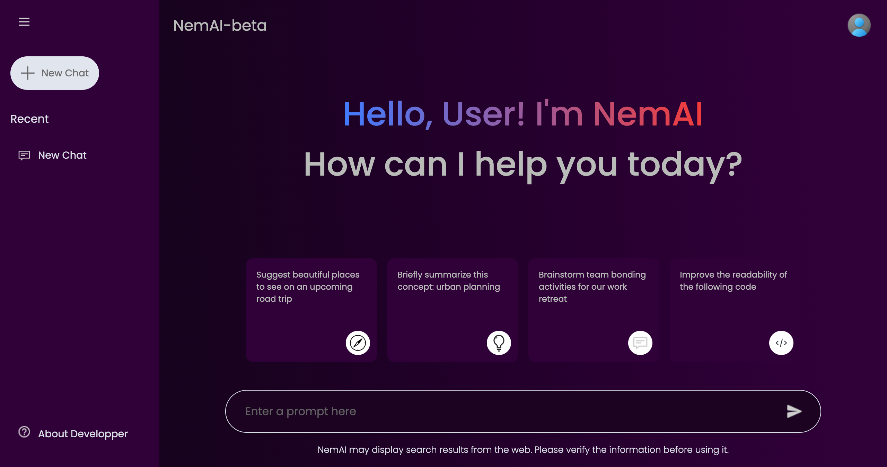

# 🚀 NemAI-beta: Your Personal AI Chatbot

Welcome to **NemAI-beta**, your very own AI-powered chatbot that brings the future of conversational AI right to your fingertips. Engage in meaningful, insightful, and fun conversations, all through an intuitive and user-friendly interface.

## 🛠️ How It Works

NemAI is built using Google gemini API & modern web technologies including React and Framer Motion. The chatbot leverages powerful AI models to understand and respond to your queries. Here’s a quick rundown of the main components:

### Main Component

- **Auto-Scrolling**: Ensures the chat view always scrolls to the latest message.
- **Message Rendering**: Displays user prompts and AI responses dynamically.
- **Loading State**: Shows a loading animation while NemAI processes your query.

### Sidebar Component

- **Collapsible Design**: Extends to reveal recent chats, settings, and more.
- **Click Outside to Close**: Automatically collapses when clicking outside the sidebar.

## 💬 Usage Tips

- **Engage**: Ask NemAI anything from serious questions to fun trivia.
- **Explore**: Click on suggested prompts to discover more about what NemAI can do.
- **Feedback**: Help us improve by sharing your experiences and suggestions.

## 🌐 Live Demo

- Responsive version is still underdevelopment🚧
- Experience NemAI-beta live: [https://nemai-beta-hrtu.vercel.app/]

## 🙌 Contributing

Welcome contributions! If you have suggestions for new features, improvements, or bug fixes, please feel free to open an issue or submit a pull request.

---

Thank you for checking out NemAI-beta! I hope you enjoy chatting with our AI as much as I enjoyed building it.
